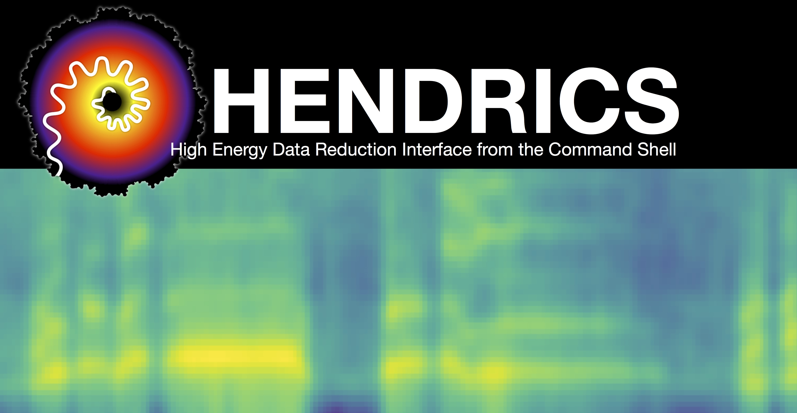

.. MaLTPyNT documentation master file, created by
   sphinx-quickstart on Fri Aug 14 18:05:00 2015.
   You can adapt this file completely to your liking, but it should at least
   contain the root `toctree` directive.

HENDRICS documentation
======================
|Build Status| |Build status| |Coverage Status| |Documentation Status|

.. Note ::

    This repository contains an evolution of MaLTPyNT. This software is
    being heavily rewritten in order to use Stingray's classes and functions
    whenever possible. To use the original MaLTPyNT, please go to
    `matteobachetti/MaLTPyNT <https://github.com/matteobachetti/MaLTPyNT>`__.

.. |Build Status| image:: https://travis-ci.org/StingraySoftware/HENDRICS.svg?branch=master
   :target: https://travis-ci.org/StingraySoftware/HENDRICS
.. |Build status| image:: https://ci.appveyor.com/api/projects/status/ifm0iydpu6gd7vwk/branch/master?svg=true
   :target: https://ci.appveyor.com/project/matteobachetti/hendrics/branch/master
.. |Coverage Status| image:: https://coveralls.io/repos/github/StingraySoftware/HENDRICS/badge.svg?branch=master&cache-control=no-cache
   :target: https://coveralls.io/github/StingraySoftware/HENDRICS?branch=master
.. |Documentation Status| image:: https://readthedocs.org/projects/hendrics/badge/?version=master
   :target: http://hendrics.readthedocs.io/en/master/?badge=master

Description
-----------

This set of command-line scripts based on
`Stingray <https://github.com/StingraySoftware/stingray>`__ is designed
to do correctly and fairly easily a **quick-look (spectral-)timing
analysis** of X-ray data, treating properly the gaps in the data due,
e.g., to occultation from the Earth or passages through the SAA.

Originally, its development as MaLTPyNT - Matteo's Libraries and Tools
in Python for NuSTAR Timing - was driven by the need of performing
aperiodic timing analysis on NuSTAR data, whose long dead time made it
difficult to treat power density spectra with the usual tools. By
exploiting the presence of two independent detectors, one could use the
**cospectrum** as a proxy for the power density spectrum (for an
explanation of why this is important, look at Bachetti et al., *ApJ*,
800, 109 -`arXiv:1409.3248 <http://arxiv.org/abs/1409.3248>`__).

Today, this set of command line scripts is much more complete and it is
capable of working with the data of many more satellites. Among the
features already implemented are power density and cross spectra, time
lags, pulsar searches with the Epoch folding and the Z\_n^2 statistics,
color-color and color-intensity diagrams. More is in preparation:
rms-energy, lag-energy, covariance-energy spectra, Lomb-Scargle
periodograms and in general all that is available in
`Stingray <https://github.com/StingraySoftware/stingray>`__. The
analysis done in HENDRICS will be compatible with the graphical user
interface `DAVE <https://github.com/StingraySoftware/dave>`__, so that
users will have the choice to analyze single datasets with an easy
interactive interface, and continue the analysis in batch mode with
HENDRICS. The periodograms produced by HENDRICS (like a power density
spectrum or a cospectrum), can be saved in a format compatible with
`Xspec <http://heasarc.gsfc.nasa.gov/xanadu/xspec/>`__ or
`Isis <http://space.mit.edu/home/mnowak/isis_vs_xspec/mod.html>`__, for
those who are familiar with those fitting packages. Despite its original
main focus on NuSTAR, the software can be used to make standard
aperiodic timing analysis on X-ray data from, in principle, any other
satellite (for sure XMM-Newton and RXTE).

What's new
----------
HENDRICS 3.0
~~~~~~~~~~~~
The API is now rewritten to use
`Stingray <https://github.com/StingraySoftware/stingray>`__ where possible.
All MPxxx scripts are renamed to HENxxx.

Functionality additions:

+ Epoch folding search
+ Z-squared search
+ Color-Color Diagrams and Hardness-Intensity Diagrams
+ Power spectral fitting

(MaLTPyNT) 2.0
~~~~~~~~~~~~~~
.. Note ::

    MaLTPyNT provisionally accepted as an
    `Astropy affiliated package <http://www.astropy.org/affiliated/index.html>`__

In preparation for the 2.0 release, the API has received some visible changes.
Names do not have the `mp_` prefix anymore, as they were very redundant; the
structure of the code base is now based on the AstroPy structure; tests have
been moved and the documentation improved.

`HENexposure` is a new livetime correction script on sub-second timescales for
NuSTAR. It will be able to replace `nulccorr`, and get results on shorter bin
times, in observations done with a specific observing mode, where the observer
has explicitly requested to telemeter all events (including rejected) and the
user has run `nupipeline` with the `CLEANCOLS = NO` option.
This tool is under testing.

`HENfake` is a new script to create fake observation files in FITS format, for
testing. New functions to create fake data will be added to `hendrics.fake`.

Preliminary notes
-----------------

HENDRICS vs FTOOLS (and together with FTOOLS)
~~~~~~~~~~~~~~~~~~~~~~~~~~~~~~~~~~~~~~~~~~~~~

vs POWSPEC
++++++++++

HENDRICS does a better job than POWSPEC from several points of view:

- **Good time intervals** (GTIs) are completely avoided in the
  computation. No gaps dirtying up the power spectrum! (This is
  particularly important for NuSTAR, as orbital gaps are always present
  in typical observation timescales)

- The number of bins used in the power spectrum (or the cospectrum)
  need not be a power of two! No padding needed.

Clarification about dead time treatment
+++++++++++++++++++++++++++++++++++++++
HENDRICS **does not supersede**
`nulccorr <https://heasarc.gsfc.nasa.gov/ftools/caldb/help/nulccorr.html>`__ (yet).
If one is only interested in frequencies below ~0.5 Hz, nulccorr treats
robustly various dead time components and its use is recommended. Light
curves produced by nulccorr can be converted to HENDRICS format using
``HENlcurve --fits-input <lcname>.fits``, and used for the subsequent
steps of the timing analysis.

.. Note :: Improved livetime correction in progress!

    ``HENexposure`` tries to push the livetime
    correction to timescales below 1 s, allowing livetime-corrected timing
    analysis above 1 Hz. The feature is under testing

License and notes for the users
~~~~~~~~~~~~~~~~~~~~~~~~~~~~~~~

This software is released with a 3-clause BSD license. You can find
license information in the ``LICENSE.rst`` file.

**If you use this software in a publication**, please refer to its
Astrophysics Source Code Library identifier:

1. Bachetti, M. 2015, MaLTPyNT, Astrophysics Source Code Library, record `ascl:1502.021 <http://ascl.net/1502.021>`__.

In particular, **if you use the cospectrum**, please also refer to:

2. Bachetti et al. 2015, `ApJ <http://iopscience.iop.org/0004-637X/800/2/109/>`__ , **800**, 109.

I listed a number of **open issues** in the
`Issues <https://bitbucket.org/mbachett/hendics/issues?status=new&status=open>`__
page. Feel free to **comment** on them and **propose more**. Please
choose carefully the category: bugs, enhancements, etc.

Acknowledgements
----------------
HENDRICS 2.0
~~~~~~~~~~~~
TBW

(MaLTPyNT) 2.0
~~~~~~~~~~~~~~
I would like to thank all the co-authors of `the NuSTAR timing
paper <http://arxiv.org/abs/1409.3248>`__ and the NuSTAR X-ray binaries
working group. This software would not exist without the interesting
discussions before and around that paper. In particular, I would like to
thank Ivan Zolotukhin, Francesca Fornasini, Erin Kara, Felix Fürst,
Poshak Gandhi, John Tomsick and Abdu Zoghbi for helping testing the code
and giving various suggestions on how to improve it. Last but not least,
I would like to thank Marco Buttu (by the way, `check out his book if
you speak
Italian <http://www.amazon.it/Programmare-con-Python-completa-DigitalLifeStyle-ebook/dp/B00L95VURC/ref=sr_1_1?s=books&ie=UTF8&qid=1424298092&sr=1-1>`__)
for his priceless pointers on Python coding and code management
techniques.

Getting started
---------------

.. toctree::
   :maxdepth: 2

   install
   tutorials/index

Command line interface
----------------------

.. toctree::
   :maxdepth: 2

   scripts/cli

API documentation
-----------------

.. toctree::
   :maxdepth: 2

   hendrics/modules
   hendrics/index

Indices and tables
==================

* :ref:`genindex`
* :ref:`modindex`
* :ref:`search`
