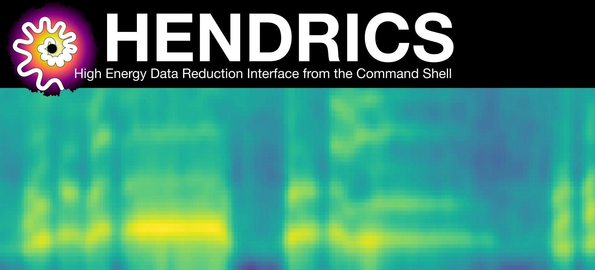

.. HENDRICS documentation main file, created by
   sphinx-quickstart on Fri Aug 14 18:05:00 2015.
   You can adapt this file completely to your liking, but it should at least
   contain the root `toctree` directive.

HENDRICS documentation
======================
|Build Status| |Coverage Status| |Documentation Status|

.. |Build Status| image:: https://github.com/StingraySoftware/HENDRICS/actions/workflows/ci_test.yml/badge.svg
    :target: https://github.com/StingraySoftware/HENDRICS/actions/workflows/ci_test.yml
.. |Coverage Status| image:: https://codecov.io/gh/StingraySoftware/HENDRICS/branch/main/graph/badge.svg
  :target: https://app.codecov.io/gh/StingraySoftware/HENDRICS
.. |Documentation Status| image:: https://readthedocs.org/projects/hendrics/badge/?version=main
   :target: https://hendrics.stingray.science/en/main/?badge=main

Description
-----------

This set of command-line scripts based on
`Stingray <https://github.com/StingraySoftware/stingray>`__ is designed
to do correctly and fairly easily a **quick-look (spectral-) timing
analysis** of X-ray data. Among the
features already implemented are power density and cross spectra, time
lags, pulsar searches with the Epoch folding and the Z\_n^2 statistics,
color-color and color-intensity diagrams, rms-energy, lag-energy,
covariance-energy spectra. The
analysis done in HENDRICS will be compatible with the graphical user
interface `DAVE <https://github.com/StingraySoftware/dave>`__, so that
users will have the choice to analyze single datasets with an easy
interactive interface, and continue the analysis in batch mode with
HENDRICS. The periodograms produced by HENDRICS (like a power density
spectrum or a cospectrum), can be saved in a format compatible with
``XSpec`` or ``ISIS``, for
those who are familiar with those fitting packages. Despite its original
main focus on NuSTAR, the software can be used to make standard
aperiodic timing analysis on X-ray data from, in principle, any other
satellite (for sure XMM-Newton and RXTE).

What's new
----------

Since HENDRICS 8.0
~~~~~~~~~~~~~~~~~~

- Many bug fixes in HENDRICS, including parameter passing in Z_n statistics, invalid coordinate handling,
  Numba compatibility, TOA fitting initialization
- Improvements to OGIP format handling, imageio warnings, and log file management
- Performance enhancements with memmap in zsearch and new safe intervals in event reading
- Bad candidate filtering and support for filling short bad time intervals with random data
- Multiple bugfixes and features from Stingray versions up to `2.3 <https://github.com/StingraySoftware/stingray/releases/tag/v2.3>`__
- New build infrastructure using `pyproject.toml` (PEP 621 compliant)

See full CHANGELOG for details.

Preliminary notes
-----------------

HENDRICS vs FTOOLS (and together with FTOOLS)
~~~~~~~~~~~~~~~~~~~~~~~~~~~~~~~~~~~~~~~~~~~~~

vs POWSPEC
++++++++++

HENDRICS does a better job than POWSPEC from several points of view:

- **Good time intervals** (GTIs) are completely avoided in the
  computation. No gaps dirtying up the power spectrum! (This is
  particularly important for NuSTAR, as orbital gaps are always present
  in typical observation timescales)

- The number of bins used in the power spectrum (or the cospectrum)
  need not be a power of two! No padding needed.

License and notes for the users
~~~~~~~~~~~~~~~~~~~~~~~~~~~~~~~

This software is released with a 3-clause BSD license. You can find
license information in the ``LICENSE.rst`` file.

**If you use this software in a publication**, please refer to its
Astrophysics Source Code Library identifier:

1. Bachetti, M. 2018, HENDRICS: High ENergy Data Reduction Interface from the Command Shell, record `ascl:1805.019 <https://ascl.net/1805.019>`__.

and please also cite `stingray <https://stingray.science/stingray/citing.html>`

In particular, **if you use the cospectrum**, please also refer to:

2. Bachetti et al. 2015, `ApJ <https://iopscience.iop.org/article/10.1088/0004-637X/800/2/109>`__ , **800**, 109.

If you have found a bug please report it by creating a
new issue on the `HENDRICS GitHub issue tracker. <https://github.com/StingraySoftware/HENDRICS/issues>`_

Acknowledgements
----------------

(MaLTPyNT) 2.0
~~~~~~~~~~~~~~
I would like to thank all the co-authors of `the NuSTAR timing
paper <https://arxiv.org/abs/1409.3248>`__ and the NuSTAR X-ray binaries
working group. This software would not exist without the interesting
discussions before and around that paper. In particular, I would like to
thank Ivan Zolotukhin, Francesca Fornasini, Erin Kara, Felix Fürst,
Poshak Gandhi, John Tomsick and Abdu Zoghbi for helping testing the code
and giving various suggestions on how to improve it. Last but not least,
I would like to thank Marco Buttu (by the way, `check out his book if
you speak
Italian <https://www.amazon.it/Programmare-con-Python-completa-DigitalLifeStyle-ebook/dp/B00L95VURC/ref=sr_1_1?s=books&ie=UTF8&qid=1424298092&sr=1-1>`__)
for his priceless pointers on Python coding and code management
techniques.

Getting started
---------------

.. toctree::
   :maxdepth: 2

   install
   tutorials/index

Command line interface
----------------------

.. toctree::
   :maxdepth: 2

   scripts/cli

API documentation
-----------------

.. toctree::
   :maxdepth: 2

   hendrics/modules

Indices and tables
==================

* :ref:`genindex`
* :ref:`modindex`
* :ref:`search`
