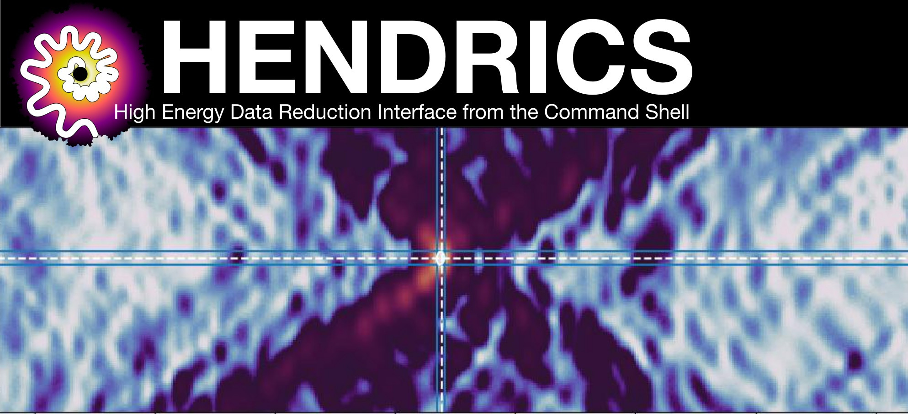

.. HENDRICS documentation main file, created by
   sphinx-quickstart on Fri Aug 14 18:05:00 2015.
   You can adapt this file completely to your liking, but it should at least
   contain the root `toctree` directive.

HENDRICS documentation
======================
|Build Status| |Coverage Status| |Documentation Status|

.. |Build Status| image:: https://github.com/StingraySoftware/HENDRICS/workflows/CI%20Tests/badge.svg
    :target: https://github.com/StingraySoftware/HENDRICS/actions/
.. |Coverage Status| image:: https://codecov.io/gh/StingraySoftware/HENDRICS/branch/main/graph/badge.svg
  :target: https://app.codecov.io/gh/StingraySoftware/HENDRICS
.. |Documentation Status| image:: https://readthedocs.org/projects/hendrics/badge/?version=main
   :target: https://hendrics.stingray.science/en/main/?badge=main

Description
-----------

This set of command-line scripts based on
`Stingray <https://github.com/StingraySoftware/stingray>`__ is designed
to do correctly and fairly easily a **quick-look (spectral-) timing
analysis** of X-ray data. Among the
features already implemented are power density and cross spectra, time
lags, pulsar searches with the Epoch folding and the Z\_n^2 statistics,
color-color and color-intensity diagrams, rms-energy, lag-energy,
covariance-energy spectra. The
analysis done in HENDRICS will be compatible with the graphical user
interface `DAVE <https://github.com/StingraySoftware/dave>`__, so that
users will have the choice to analyze single datasets with an easy
interactive interface, and continue the analysis in batch mode with
HENDRICS. The periodograms produced by HENDRICS (like a power density
spectrum or a cospectrum), can be saved in a format compatible with
``XSpec`` or ``ISIS``, for
those who are familiar with those fitting packages. Despite its original
main focus on NuSTAR, the software can be used to make standard
aperiodic timing analysis on X-ray data from, in principle, any other
satellite (for sure XMM-Newton and RXTE).

What's new
----------

HENDRICS 8.0.0rc1
~~~~~~~~~~~~~~~~~

+ Compatible with `Stingray 2.0.0rc1 <https://github.com/StingraySoftware/stingray/releases/tag/v2.0.0rc1>`__, which introduced:

    + Lomb-Scargle periodograms and cross spectra are now available
    + Power colors
    + Easy filling of small gaps in light curves with random data
    + Generic timeseries (complex data, multi-dimensional data)

+ ``HENaccelsearch`` now has additional options for detrending, denoising and deorbiting
+ An improved Maximum likelihood algorithm as FFTFIT substitute for TOA calculation
+ NASA's IXPE added to supported missions
+ Better support of Stingray's native file formats

HENDRICS 7.0
~~~~~~~~~~~~

+ Based on `Stingray 1.0 <https://github.com/StingraySoftware/stingray/releases/tag/v1.0>`__, bringing a huge bump in performance
+ Following Astropy, Numpy and Scipy, HENDRICS 7.0 is only compatible with Python >3.8
+ Accepts many more file formats for round-trip of Stingray objects, thanks to the new functionality of Stingray.
+ Energy-filtered periodograms
+ A wider range of normalizations available for both ``HENfold`` and ``HENphaseogram``, with more options (e.g. smoothing) and higher-contrast color map by default
+ Many fixes to mission-specific files
+ Better info returned by Z/EF searches, including pulse amplitude estimates
+ New upper limit functionality in Z/EF searches with no candidates
+ ``HENplot`` now estimates the error of frequency and frequency derivative searches returned by ``HENzsearch``  and ``HENefsearch`` with option ``--fast``
+ Add ability to split files at a given MJD

HENDRICS 6.0
~~~~~~~~~~~~

+ Much Improved mission support
+ Lots of performance improvements with large datasets
+ Improved simulation and upper limit determination for Z searches
+ Improved candidate searching in Z searches
+ Lots of documentation fixes

HENDRICS 5.0
~~~~~~~~~~~~
More improvements to pulsar functionalities:

+ The accelerated search from Ransom+2002 is now available, to search the f-fdot space through Fourier analysis. It is highly performant but still needs some work. Please consider it experimental.
+ A much faster folding algorithm (See Bachetti+2020, ApJ) is now available, allowing to reduce the computing time of Z searches by a factor ~10, while simultaneously searching a 2D space of frequency and fdot. Select with ``--fast`` option
+ The classic Fast Folding Algorithm (Staelin 1969) is also available, to allow for extra-fast searches at low frequencies. However, this does not allow for "accelerated" searches on fdot. Also experimental and probably worth of further optimization.

Developed as part of CICLOPS -- Citizen Computing Pulsar Search, a project supported by *POR FESR Sardegna 2014 – 2020 Asse 1 Azione 1.1.3* (code RICERCA_1C-181), call for proposal "Aiuti per Progetti di Ricerca e Sviluppo 2017" managed by Sardegna Ricerche.

HENDRICS 4.0
~~~~~~~~~~~~
Lots of improvements to pulsar functionalities;

.. Note ::

    Windows support for Python <3.6 was dropped. Most of the code will still work on old versions,
    but the difficulty of tracking down library versions to test in Appveyor forces me
    to drop the obsolescent versions of Python from testing on that architecture.

HENDRICS 3.0
~~~~~~~~~~~~
The API is now rewritten to use
`Stingray <https://github.com/StingraySoftware/stingray>`__ where possible.
All MPxxx scripts are renamed to HENxxx.

Functionality additions:

+ Epoch folding search
+ Z-squared search
+ Color-Color Diagrams and Hardness-Intensity Diagrams
+ Power spectral fitting

(MaLTPyNT) 2.0
~~~~~~~~~~~~~~
.. Note ::

    MaLTPyNT provisionally accepted as an
    `Astropy affiliated package <https://www.astropy.org/affiliated/index.html>`__

In preparation for the 2.0 release, the API has received some visible changes.
Names do not have the `mp_` prefix anymore, as they were very redundant; the
structure of the code base is now based on the AstroPy structure; tests have
been moved and the documentation improved.

`HENexposure` is a new livetime correction script on sub-second timescales for
NuSTAR. It will be able to replace `nulccorr`, and get results on shorter bin
times, in observations done with a specific observing mode, where the observer
has explicitly requested to telemeter all events (including rejected) and the
user has run `nupipeline` with the `CLEANCOLS = NO` option.
This tool is under testing.

`HENfake` is a new script to create fake observation files in FITS format, for
testing. New functions to create fake data will be added to `hendrics.fake`.

Preliminary notes
-----------------

HENDRICS vs FTOOLS (and together with FTOOLS)
~~~~~~~~~~~~~~~~~~~~~~~~~~~~~~~~~~~~~~~~~~~~~

vs POWSPEC
++++++++++

HENDRICS does a better job than POWSPEC from several points of view:

- **Good time intervals** (GTIs) are completely avoided in the
  computation. No gaps dirtying up the power spectrum! (This is
  particularly important for NuSTAR, as orbital gaps are always present
  in typical observation timescales)

- The number of bins used in the power spectrum (or the cospectrum)
  need not be a power of two! No padding needed.

Clarification about dead time treatment
+++++++++++++++++++++++++++++++++++++++
HENDRICS **does not supersede**
`nulccorr <https://heasarc.gsfc.nasa.gov/ftools/caldb/help/nulccorr.html>`__ (yet).
If one is only interested in frequencies below ~0.5 Hz, nulccorr treats
robustly various dead time components and its use is recommended. Light
curves produced by nulccorr can be converted to HENDRICS format using
``HENlcurve --fits-input <lcname>.fits``, and used for the subsequent
steps of the timing analysis.

.. Note :: Improved livetime correction in progress!

    ``HENexposure`` tries to push the livetime
    correction to timescales below 1 s, allowing livetime-corrected timing
    analysis above 1 Hz. The feature is under testing

License and notes for the users
~~~~~~~~~~~~~~~~~~~~~~~~~~~~~~~

This software is released with a 3-clause BSD license. You can find
license information in the ``LICENSE.rst`` file.

**If you use this software in a publication**, please refer to its
Astrophysics Source Code Library identifier:

1. Bachetti, M. 2018, HENDRICS: High ENergy Data Reduction Interface from the Command Shell, record `ascl:1805.019 <https://ascl.net/1805.019>`__.

and please also cite `stingray <https://stingray.science/stingray/citing.html>`

In particular, **if you use the cospectrum**, please also refer to:

2. Bachetti et al. 2015, `ApJ <https://iopscience.iop.org/article/10.1088/0004-637X/800/2/109>`__ , **800**, 109.

If you have found a bug please report it by creating a
new issue on the `HENDRICS GitHub issue tracker. <https://github.com/StingraySoftware/HENDRICS/issues>`_

Acknowledgements
----------------

(MaLTPyNT) 2.0
~~~~~~~~~~~~~~
I would like to thank all the co-authors of `the NuSTAR timing
paper <https://arxiv.org/abs/1409.3248>`__ and the NuSTAR X-ray binaries
working group. This software would not exist without the interesting
discussions before and around that paper. In particular, I would like to
thank Ivan Zolotukhin, Francesca Fornasini, Erin Kara, Felix Fürst,
Poshak Gandhi, John Tomsick and Abdu Zoghbi for helping testing the code
and giving various suggestions on how to improve it. Last but not least,
I would like to thank Marco Buttu (by the way, `check out his book if
you speak
Italian <https://www.amazon.it/Programmare-con-Python-completa-DigitalLifeStyle-ebook/dp/B00L95VURC/ref=sr_1_1?s=books&ie=UTF8&qid=1424298092&sr=1-1>`__)
for his priceless pointers on Python coding and code management
techniques.

Getting started
---------------

.. toctree::
   :maxdepth: 2

   install
   tutorials/index

Command line interface
----------------------

.. toctree::
   :maxdepth: 2

   scripts/cli

API documentation
-----------------

.. toctree::
   :maxdepth: 2

   hendrics/modules

Indices and tables
==================

* :ref:`genindex`
* :ref:`modindex`
* :ref:`search`
