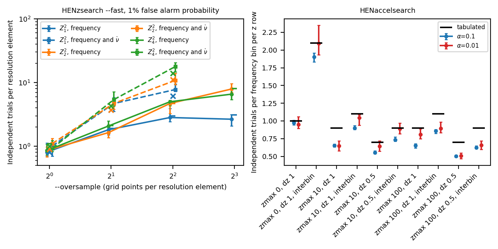
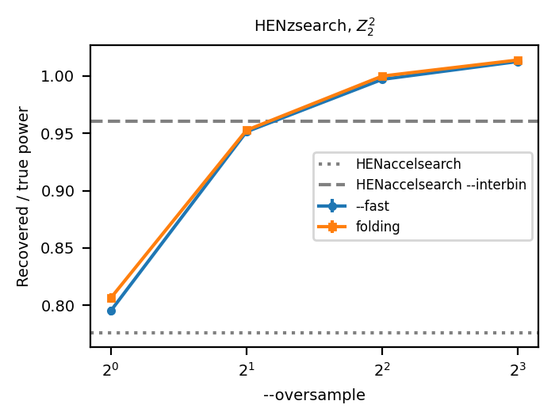
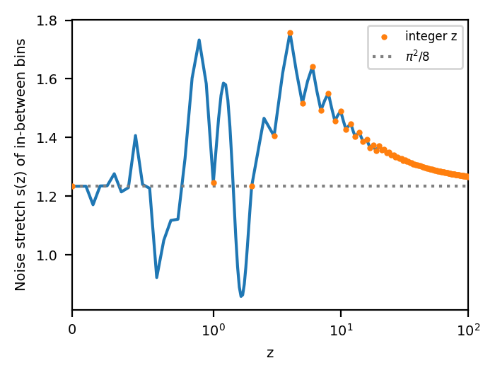
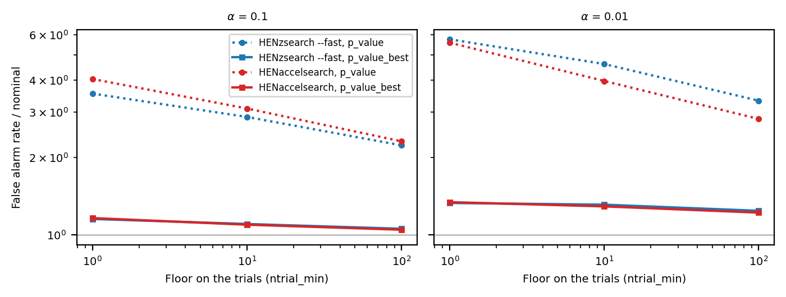

.. _technical-details:

Significance of pulsation searches
==================================

This page explains how ``HENzsearch`` and ``HENaccelsearch`` turn the peaks of
a periodogram into probabilities, and how the numbers they use were measured.
The recipes for using them are in the :ref:`pulsation-searches-tutorial` and
:ref:`targeted-searches-tutorial` tutorials.

Every candidate table reports three probabilities:

``p_1trial``
    The probability that pure noise gives a peak at least this high in a
    single, specified point of the search.
``p_ntrial``
    The same, corrected for the naive number of trials: one per resolution
    element of the search.
``p_ntrial_adj``
    The same, corrected for the *calibrated* number of trials described below.
    This is the one to use for a blind search.

The correction for :math:`N` trials is
:math:`p_N = 1 - (1 - p_1)^N`, which is about :math:`N p_1` for small
probabilities.

Measuring the number of trials
------------------------------

The points of a search grid are correlated. Two frequencies closer than the
resolution :math:`1/T` see almost the same noise, but not exactly the same, and
the maximum of the search picks up the fluctuations between them. The number of
*independent* trials is therefore not the number of grid points, nor the number
of resolution elements: it has to be measured.

We simulate many data sets of pure noise, run the search on each, and record
the smallest single-trial probability :math:`p_{\min}` of the whole search. If
the search behaved as :math:`N` independent trials, :math:`p_{\min}` would be
smaller than :math:`p` with probability :math:`1 - (1 - p)^N`. Calling
:math:`p_\alpha` the value that :math:`p_{\min}` falls below in a fraction
:math:`\alpha` of the simulations, the effective number of trials at false alarm
probability :math:`\alpha` is

.. math::

    N_{\rm eff}(\alpha) = \frac{\ln(1 - \alpha)}{\ln(1 - p_\alpha)}.

The simulations use observations of :math:`T = 1000` s with 5000 events of
Poisson noise, and the uncertainties come from bootstrap resampling of the
simulations. They are run by ``notebooks/trials_calibration.py``, for example::

    $ python notebooks/trials_calibration.py qffa --nreal 3000 --outdir calib
    $ python notebooks/trials_calibration.py plot --outdir calib

The summary tables used on this page are in ``docs/images/trials_calibration``.

For every configuration, HENDRICS uses the largest estimate at 10% and 1% false
alarm probability, rounded up to 0.1, and forced not to decrease with the
number of harmonics or the oversampling. Between tabulated values it uses the
next larger one. All these choices overestimate the number of trials, which
makes the significances conservative.

    Independent trials measured on pure noise at 1% false alarm probability.
    Left: ``HENzsearch --fast``, per resolution element, with the tabulated
    values as horizontal ticks (frequency only) and crosses (frequency and
    frequency derivative). Right: ``HENaccelsearch``, per frequency bin per z
    row, with the tabulated values as black ticks.

The fast folding search (``HENzsearch --fast``)
~~~~~~~~~~~~~~~~~~~~~~~~~~~~~~~~~~~~~~~~~~~~~~~

The naive number of trials is the number of grid points divided by
``--oversample`` for each searched axis. The resolution elements are
:math:`1/T` in frequency and :math:`4/T^2` in frequency derivative (the latter
gives the same phase error at the edges of the observation as :math:`1/T` in
frequency, with phases measured from its middle). The calibrated number of
trials is the naive one times:

.. list-table:: Trials per resolution element, frequency only
    :header-rows: 1

    * - Harmonics
      - ``--oversample`` 1
      - 2
      - 4
      - 8
    * - 1
      - 1.1
      - 1.9
      - 3.0
      - 3.1
    * - 2
      - 1.1
      - 2.1
      - 4.7
      - 8.0
    * - 4
      - 1.1
      - 2.1
      - 5.0
      - 8.0

.. list-table:: Trials per resolution element, frequency and frequency derivative
    :header-rows: 1

    * - Harmonics
      - ``--oversample`` 1
      - 2
      - 4
    * - 1
      - 0.8
      - 3.7
      - 6.1
    * - 2
      - 0.9
      - 3.7
      - 11.0
    * - 4
      - 1.0
      - 4.3
      - 13.9

Grids beyond the table use its largest value, with a warning: their
significances may be overestimated. On the same grids, the slow folding search
(``HENzsearch`` without ``--fast``) gives the same numbers within the
uncertainties (``summary_folding.ecsv``).

The tables were measured on bands of 0.25 Hz (frequency only) and 0.05 Hz (with
the frequency derivative), with 32 phase bins and 3000 simulations each. Wider
bands (1 and 4 Hz) and 128 phase bins give the same numbers within the
uncertainties, or smaller ones. A run of 20000 simulations of the
:math:`Z^2_2` search with ``--oversample 4`` gives 3.4, 3.7 and 2.9 trials per
resolution element at 10%, 1% and 0.1% false alarm probability, below the
tabulated 4.7: the calibration holds in the tail.

Why oversample, then? Because a signal between two grid points loses power.
The figure below shows the power recovered by the search relative to the power
at the exact frequency, for a :math:`Z^2_2` signal: 80% without oversampling,
95% with ``--oversample 2``, and all of it from ``--oversample 4``. The price is
in trials; the default of ``2 * N`` points per resolution element for
:math:`Z^2_N` is a compromise between the two.

    Power recovered by the search, relative to the power at the true frequency,
    averaged over signal frequencies. The horizontal lines are the accelerated
    search, with and without interbinning.

The accelerated search (``HENaccelsearch``)
~~~~~~~~~~~~~~~~~~~~~~~~~~~~~~~~~~~~~~~~~~~

Stingray searches :math:`n_{\rm freq}` Fourier bins for each of the
:math:`n_z` rows of ``np.arange(-zmax, zmax, delta_z)``, where :math:`z` is the
drift in Fourier bins over the observation. The calibrated number of trials is
:math:`n_{\rm freq} \times \max(n_z, 1) \times c`, with :math:`c` from:

.. list-table:: Trials per frequency bin per z row
    :header-rows: 1

    * - Search
      - Without ``--interbin``
      - With ``--interbin``
    * - No z search (``zmax`` 0)
      - 1.0
      - 2.1
    * - ``delta_z`` 1
      - 0.9
      - 1.1
    * - ``delta_z`` 0.5
      - 0.7
      - 0.9

Steps between 0.5 and 1 are interpolated linearly, finer steps use the 0.5
value, and coarser steps count the rows as independent. For the default search
(``zmax`` 100, ``delta_z`` 1) this is 180 trials per frequency bin, which raises
the detection threshold by about 10 in Leahy power compared with the old count
of one trial per frequency bin. The numbers were measured with 10000
simulations, with ``zmax`` 0, 10 and 100.

``HENaccelsearch`` delegates the search to Stingray, which only returns the
candidates above a power threshold computed with :math:`n_{\rm freq}` trials.
HENDRICS asks instead for the threshold corresponding to the requested false
alarm probability with the calibrated number of trials (lowered, if needed, so
that it also catches the in-between bins of interbinning, see below), and then
keeps the candidates with ``p_ntrial_adj`` below the false alarm probability.
With a known ephemeris it asks for the threshold of a single trial, and keeps the
candidates by their corrected probability.

``--pad_to_double`` was not simulated: its significances are only approximate.

Interbinning
~~~~~~~~~~~~

Interbinning (``--interbin``) recovers part of the power lost between Fourier
bins by adding a bin between each pair,

.. math::

    A_{k+1/2} = \frac{\pi}{4} \left(A_{k+1} - A_k\right).

The regular bins keep the usual noise distribution of Leahy powers, a
:math:`\chi^2` with two degrees of freedom: :math:`p_1 = e^{-P/2}`. The
in-between bins do not. They are the difference of two neighbouring bins, which
after the acceleration correction are correlated. Their noise is still
exponential, but stretched by

.. math::

    s(z) = \frac{\pi^2}{8}\left(1 - {\rm Re}\,\rho_1(z)\right),
    \qquad
    \rho_1(z) = \frac{\sum_q w_{q+1} w_q^*}{\sum_q |w_q|^2},

where :math:`w` is the response used by Stingray to correct for the drift
:math:`z`, and :math:`\rho_1` the correlation between neighbouring bins that it
introduces. The single-trial probability of an in-between bin is
:math:`p_1 = e^{-P/(2 s)}`. For a plain Fourier search (:math:`z = 0`) the bins
are independent and :math:`s = \pi^2/8 \approx 1.23`: without this correction,
a noise power :math:`P` in an in-between bin looked as significant as a power
:math:`1.23\,P` really is.

HENDRICS recognizes in-between bins from their frequency (Stingray reports
:math:`r/T`, so :math:`r` is a half integer), and computes :math:`s(z)` from
Stingray's responses (``hendrics.known_ephemeris.interbin_stretch``). The tests
check, on simulated white noise passed through Stingray's own convolution and
interbinning, that the resulting probabilities are uniformly distributed for
:math:`z` = 0, 0.25, 0.5, 1, 5, 10 and 100.

    Stretch of the noise distribution of the in-between bins as a function of
    z. ``HENaccelsearch`` uses integer z values with the default ``--delta-z``.

Targeted searches
-----------------

With a known ephemeris (see :ref:`targeted-searches-tutorial`), each candidate
is charged a number of trials that grows with its distance from the prediction.
The cells of the search are ranked, before looking at the data, by that
distance. The charge of a candidate, ``ntrial_eff``, is the calibrated number
of trials of the blind search times the fraction of the grid that is at least as
close to the prediction, with a floor ``ntrial_min`` covering the uncertainty
region of the ephemeris (three standard deviations), and never more than the
blind search. Its probability is ``p_value``.

Picking the best candidate
~~~~~~~~~~~~~~~~~~~~~~~~~~

``p_value`` is honest for a candidate chosen before looking at the data. But
the reported candidate is the *most significant* one after the correction, and
that choice has a price. Think of the false alarm probability :math:`\alpha` as
a budget: a cell charged :math:`n` trials uses up about :math:`\alpha / n` of
it, and the chance that any cell gives a false alarm is at most the sum over
all cells. For a blind search, :math:`N` cells charged :math:`N` trials each use
exactly :math:`\alpha`. Ranking the cells charges the :math:`r`-th closest cell
about :math:`r` trials, and the sum becomes
:math:`\alpha \sum_r 1/r \approx \alpha \left(1 + \ln(N / n_{\min})\right)`,
where the first :math:`n_{\min}` cells, inside the floor, contribute
:math:`\alpha` together.

``p_value_best`` pays for this, charging
:math:`\min\left(k \times {\tt ntrial\_eff},\ N\right)` trials with
:math:`k = 1 + \ln(N / n_{\min})`. :math:`k` is about 10 for a typical search
and no uncertainty on the ephemeris, and 1 when the uncertainty region covers
the whole search. ``HENzsearch`` uses ``p_value_best`` to decide whether the
candidate is detected, and ``HENaccelsearch`` sorts its candidates by it.

The table below shows the rate of false alarms measured on 10000 simulations of
pure noise, relative to the nominal false alarm probability (1 is exact, less
is conservative), with the calibrated number of trials of each tool:
2 harmonics, ``--oversample 4`` and a frequency derivative search for
``HENzsearch --fast`` (5632 trials), ``zmax`` 10 for ``HENaccelsearch`` (18000
trials).

.. list-table:: False alarms relative to nominal, at 10%, 1% and 0.1%
    :header-rows: 1

    * - Tool
      - Floor ``ntrial_min``
      - ``p_value``
      - ``p_value_best``
      - Blind search
    * - ``HENzsearch --fast``
      - 1
      - 3.5, 5.8, 7.0
      - 1.15, 1.33, 1.7
      - 0.79, 0.85, 1.2
    * - ``HENzsearch --fast``
      - 100
      - 2.2, 3.3, 3.7
      - 1.06, 1.24, 1.6
      - 0.79, 0.85, 1.2
    * - ``HENaccelsearch``
      - 1
      - 4.0, 5.6, 5.2
      - 1.16, 1.34, 1.7
      - 0.79, 1.0, 1.1
    * - ``HENaccelsearch``
      - 100
      - 2.3, 2.8, 2.7
      - 1.05, 1.22, 1.5
      - 0.79, 1.0, 1.1

The figures at 0.1% rest on about ten events each, and are uncertain by
:math:`\pm 0.4`.

``p_value_best`` removes most of the excess, but not all of it: both tools
still give false alarms about 1.1 times too often at 10%, and 1.2-1.3 times at
1%. The reason is
the promise that a candidate never costs more than in a blind search. Most
cells of the grid are far enough from the prediction that
:math:`k \times {\tt ntrial\_eff}` would exceed :math:`N`, so they are charged
exactly :math:`N`: together, they use up almost the whole budget, as a blind
search would. The cells near the prediction, charged less, add their share on
top. For the ``HENaccelsearch`` grid above, the sum of the charges allows up to
1.8 times the nominal rate of false alarms for independent cells (1.6 with a
floor of 100). Splitting the budget in advance between the cells near the
prediction and a blind search would remove this, at the price of charging
distant candidates several times more than a blind search. We chose to keep the
promise and document the residual excess.

    False alarm rate of the targeted searches relative to nominal, at 10%
    (left) and 1% (right) false alarm probability, as a function of the floor
    on the trials, with and without the price of picking the best candidate.

GPU acceleration
----------------

HENDRICS can compute some of its histograms on an NVIDIA GPU (Graphics Processing
Unit) through `CuPy <https://cupy.dev>`__. This is optional and off by default:
HENDRICS installs, imports and passes its tests on machines without a GPU.

Installation
~~~~~~~~~~~~

``pip install "hendrics[gpu]"`` installs the ``cupy`` package, which is compiled
from source and needs the CUDA toolkit. It is usually easier to install the
pre-built CuPy wheel matching your CUDA version, e.g. ``pip install cupy-cuda12x``
or ``pip install "cupy-cuda13x[ctk]"``, where ``[ctk]`` also installs the CUDA
libraries (see the `CuPy installation guide
<https://docs.cupy.dev/en/stable/install.html>`__).

What runs on the GPU
~~~~~~~~~~~~~~~~~~~~

The GPU is used only when explicitly requested. From the command line, the
``--use-gpu`` option of ``HENzsearch`` affects:

* ``--fast``: the whole search runs on the GPU. The event times are copied to the
  GPU once. Then, at each step of the frequency and frequency-derivative grid, the
  pulse phases, the sub-profiles (the 2D histogram of pulse phase vs. time) and the
  Z^2 statistics of all trial shifts are computed on the GPU, and only the Z^2
  values are copied back. The results are identical to the CPU ones, to the last
  bit (see "Design" below).
* ``--transient``: the 2D histogram (pulse phase vs. time), at each trial frequency.
* ``--ffa``: the 1D histogram of the whole event list (computed once).

``HENefsearch`` accepts ``--use-gpu`` with ``--transient`` and ``--ffa`` too
(``--fast`` is only available for Z searches).

The standard folding search (without ``--fast``, ``--ffa`` or ``--transient``)
folds the events with Stingray on the CPU, so ``--use-gpu`` has no effect there
and a warning is issued.

From Python, :func:`hendrics.base.histogram` and :func:`hendrics.base.histogram2d`
accept ``use_gpu=True``, and so do :func:`hendrics.efsearch.search_with_qffa`,
:func:`hendrics.efsearch.transient_search` and
:func:`hendrics.efsearch.search_with_ffa`. The GPU histograms are also available
directly as :func:`hendrics.gpu.histogram_gpu` and
:func:`hendrics.gpu.histogram2d_gpu`.

The GPU histograms give the same results as the CPU ones:

* Values equal to the upper edge of the range are excluded, as in the CPU
  histograms of HENDRICS. :func:`numpy.histogram` and ``cupy.histogram`` include
  them in the last bin instead, so the GPU functions remove these values before
  binning. This matters in practice: in the ``--fast`` search the upper edge of
  the time range is the time of the last photon.
* The output types are the same: 64-bit floats for 1D histograms and for weighted
  2D histograms, 64-bit unsigned integers for unweighted 2D histograms.
* The ``use_memmap`` and ``tmp`` options (memory-mapped output files) only apply
  to host memory, and are ignored on the GPU.

Each call to a GPU histogram copies the input to the GPU and the histogram back
to host memory. The ``--transient`` search does this at each trial frequency.

Design
~~~~~~

:mod:`hendrics.gpu` contains a minimal backend registry, ``_BACKENDS``. Each entry
says whether the backend can be used, which array module implements it (NumPy or
CuPy), and how to copy arrays to its memory and back to host memory. Only
``"cpu"`` and ``"cupy"`` exist now; other array libraries (e.g. JAX or PyTorch)
could be added without changing the functions using the registry.

**The** ``--fast`` **search on the GPU.** At every step of the search, the event
times and the time slice (sub-profile) of each event are the same; only the pulse
phases change. ``hendrics.efsearch._FastSearchOnDevice`` is created once per
search: it copies the times and the slice indices to the GPU. At each step, its
``profiles`` method computes the phases and the sub-profiles on the GPU (with
``bincount`` on precomputed indices), and its ``stats`` method shifts and sums the
sub-profiles for every trial and computes Z^2, copying back only the Z^2 values.

The second part is a small CUDA program (a "kernel"), in ``hendrics/gpu.py``,
running one GPU thread per trial shift. It is compiled at run time by CuPy
(``cupy.RawKernel``), so it needs no dependency beyond CuPy. Writing it with
``numba.cuda`` would have needed the separate ``numba-cuda`` package.

The GPU results are identical to those of the Numba code on the CPU, not only
close:

* The phases are computed with the same operations, in the same order, as the
  Numba functions ``_fast_phase*``, and the time slice and phase bin of each event
  with the same arithmetic as the Numba 2D histogram. The events that the Numba
  histogram drops (the last one, on the upper edge of the time range, and those
  whose phase rounds to exactly 1.0) are dropped on the GPU too.
* The shifted sub-profiles are sums of whole-number counts, which are exact in any
  order.
* The Z^2 sums follow the same order as the Numba code, and the kernel is compiled
  with ``--fmad=false``: without this, the compiler could merge a multiplication
  and an addition into a single operation (a "fused multiply-add"), which rounds
  differently in the last bit.
* The shift ramps and the cosine and sine tables are computed once by Numba
  (``_fast_step_constants``, also used by the CPU ``_fast_step``) and copied to the
  GPU: Numba's ``linspace`` does not round exactly as NumPy's.

When the array module is NumPy, ``_FastSearchOnDevice`` falls back to the Numba
``_fast_step``, so the same code runs on the CPU.

**Without Numba.** Numba is an optional dependency. Without it, the CPU
histograms of HENDRICS (:func:`hendrics.base.histogram` and
:func:`hendrics.base.histogram2d`) use NumPy with the same bin arithmetic,
the same treatment of the upper edge and the same output types as the Numba
versions, so histograms and sub-profiles are identical with or without Numba, and
on the GPU. ``_fast_step`` then runs as plain Python, where NumPy adds the Z^2
terms in a different order: Z^2 values can differ from the Numba (and GPU) ones in
the last digits.

The summed profile of each trial is a small array local to each GPU thread, whose
size is fixed when the kernel is compiled (one compiled kernel per number of
bins). With a shared buffer in GPU memory instead, the kernel was about 4 times
slower, because the compiler could not assume that nothing else writes to it.

GPU memory: at most about 49 bytes per event (466 MiB for 1e7 events, with 16 or
128 phase bins): the times and slice indices (12 bytes per event) for the whole
search, plus the temporary arrays of each step. It is released at the end of the
search, and CuPy keeps it in its memory pool for reuse. The first time Numba
compiles ``_fast_step_constants`` in a Python session, the compiler keeps a
reference to the running functions until Python's garbage collector runs, so the
memory of that first search is released a little later.

``import cupy`` succeeds even on machines without a GPU, so the presence of a CUDA
device is checked only when the GPU is requested. If CuPy or a device is missing,
a ``RuntimeError`` explains what to install. The choice between CPU and GPU is
never automatic.

Testing without a GPU
~~~~~~~~~~~~~~~~~~~~~

* ``hendrics/tests/test_gpu.py`` replaces the CuPy entry of the backend registry
  with a stand-in that uses NumPy and counts the copies to the GPU and back to
  host memory. The GPU code is mostly a thin layer on top of the array module, so
  this checks argument handling, the edge convention, the output types, the
  command line options and the number of copies: in the ``--fast`` search, the
  events are copied to the GPU once per search, and one array comes back per step.
  The CUDA kernel of ``_fast_step`` cannot run on NumPy: with the stand-in, the
  Numba ``_fast_step`` is used instead.
* The tests using the real CuPy are skipped without a GPU. With a GPU, they check
  that sub-profiles, Z^2 values and whole ``--fast`` searches are identical to the
  CPU ones (``np.array_equal``, not a tolerance), for all phase formulas, several
  numbers of bins and harmonics, and with and without the frequency derivative
  search. The exact comparisons of Z^2 values with the real CuPy also need Numba.
* ``hendrics/tests/test_base.py`` checks that the NumPy fallback histograms follow
  the conventions of the Numba ones, and are identical to them when Numba is
  installed. The CI environments without the ``all`` extra run without Numba.
* ``hendrics/tests/test_gpu_kernel_sim.py`` runs the benchmark code (below) with
  numba's CUDA simulator, which executes ``numba.cuda`` kernels on the CPU. The
  simulator is enabled with ``NUMBA_ENABLE_CUDASIM=1`` before ``numba.cuda`` is
  imported, so the checks run in a separate Python process. They compare the
  custom kernel with the CPU histogram (including the case that made the original
  prototype read past the end of the input array), and the averaged power
  spectrum loops with Stingray, using NumPy in place of CuPy.

Benchmarks
~~~~~~~~~~

``benchmarks/gpu_histogram_benchmark.py`` is run by hand on a machine with a GPU::

    python benchmarks/gpu_histogram_benchmark.py --sizes 100000 10000000

It reports the best time of each method, its speedup and whether its result
agrees with the CPU version, for:

* 1D histograms: HENDRICS Numba (CPU), a custom ``numba.cuda`` kernel, and
  ``cupy.histogram``;
* a 1D histogram followed by an FFT, all on the GPU;
* 2D histograms with the shapes used by the ``--fast`` search: HENDRICS Numba
  (CPU) and ``cupy.histogram2d``;
* averaged power spectra from events: Stingray (CPU); an "unfused" GPU loop, that
  copies each light curve and each FFT back to host memory, as would happen by
  replacing the histogram and the FFT used by Stingray with GPU versions; and a
  "fused" GPU loop, where binning, FFT and averaging all stay on the GPU with a
  single copy at the end;
* one step of the ``--fast`` search (``--benchmarks qffa``), split into its parts:
  phases, 2D histogram and ``_fast_step`` on the CPU; copying the events to the
  GPU (once per search), sub-profiles and ``_fast_step`` on the GPU.

The custom ``numba.cuda`` kernel comes from the original GPU prototype (PR #181).
It is kept only in the benchmark: HENDRICS uses ``cupy.histogram`` and
``cupy.histogram2d``, which are tested upstream and also support weights and 2D
histograms. On the hardware below, the custom kernel was 1.5 to 2.3 times as fast as
``cupy.histogram``, but a 1D histogram alone beat the CPU only with 1e7 events.

On the same hardware, a GPU averaged power spectrum that keeps all data on the
GPU was 3.3 to 4.7 times faster than one copying each light curve and each FFT back
to host memory. This loop is not yet used by ``HENfspec``.

Results on real hardware
~~~~~~~~~~~~~~~~~~~~~~~~

Measured on 2026-09-15 on an NVIDIA GeForce RTX 2070 SUPER (8 GB, driver
595.91.07, CUDA 13.2) and an Intel Core i7-10700 (8 cores, 16 threads), with
Python 3.14.4, NumPy 2.4.3, Numba 0.66.0 with numba-cuda 0.30.4, CuPy 14.2.0
(``cupy-cuda13x``) and Stingray 2.3.2. CuPy needed the CUDA libraries from
``pip install "cupy-cuda13x[ctk]"``, and the custom kernel needed
``pip install "numba-cuda[cu13]"``. All tests passed, including those using
the real CuPy, and every benchmark result agreed with the CPU.

Speedup with respect to the CPU (CPU time divided by GPU time, so values below 1
mean that the GPU is slower). Times include the copies to and from the GPU.

======================================================  ======  ======  ======
Benchmark (number of events)                            1e5     1e6     1e7
======================================================  ======  ======  ======
1D histogram, 1e6 bins: ``numba.cuda`` kernel           0.15    0.74    1.49
1D histogram, 1e6 bins: ``cupy.histogram``              0.10    0.32    0.65
1D histogram + FFT: ``numba.cuda`` kernel               8.9     6.5     2.7
1D histogram + FFT: ``cupy.histogram``                  5.4     3.0     1.4
2D histogram, 16x256 bins: ``cupy.histogram2d``         0.18    0.88    1.42
2D histogram, 16x4096 bins: ``cupy.histogram2d``        0.21    1.06    1.72
Averaged PDS, 64 x 524288 bins: unfused                 2.9     2.7     2.5
Averaged PDS, 64 x 524288 bins: fused                   13.0    12.7    8.2
Averaged PDS, 256 x 524288 bins: unfused                2.9     2.7     2.8
Averaged PDS, 256 x 524288 bins: fused                  13.7    12.3    12.3
======================================================  ======  ======  ======

The Stingray averaged power spectrum took 1.2 s with 64 segments and 4.5-4.9 s
with 256 segments, almost independently of the number of events.

The ``--fast`` search on the GPU
""""""""""""""""""""""""""""""""

Measured on 2026-09-16, same hardware and software. The Z^2 values and the
candidates were identical on CPU and GPU in all cases.

End to end, ``HENzsearch --fast -f 1.22 -F 1.25 -N 2 --find-candidates -n NBIN``
on a simulated event file with 1e7 events over 1e5 s and a 2% pulsation at
1.235 Hz (376 steps of the search, 32 x 32 trials each). 16 bins is the minimum
for N = 2 (8 bins per harmonic); 128 is the default. Total times include reading
the file and analysing the candidates; the search loop times come from the
progress bar.

=============  ==========================  ==========================  =========
Phase bins     CPU: total (search loop)    GPU: total (search loop)    Speedup
=============  ==========================  ==========================  =========
16             27.0 s (23 s)               7.2 s (2 s)                 3.8 (11)
128            64.0 s (60 s)               16.2 s (11 s)               4.0 (5.5)
=============  ==========================  ==========================  =========

One step of the search (``--benchmarks qffa``), 1e7 events, 1024 trials, best of
5 calls, in milliseconds:

=====================================================  =========  =========
Part of the step                                       16 bins    128 bins
=====================================================  =========  =========
CPU: phases                                            10.8       11.0
CPU: 2D histogram                                      28.6       40.9
CPU: ``_fast_step`` (shift, sum, Z^2)                  1.9        75.7
**CPU: whole step**                                    **43.8**   **131.6**
GPU: copy the events to the GPU (once per search)      65.3       66.8
GPU: phases and sub-profiles                           3.2        4.2
GPU: ``_fast_step`` and copy back                      0.8        27.6
**GPU: whole step**                                    **4.0**    **27.6**
=====================================================  =========  =========

With few bins the histogram dominates the CPU step, and with many bins
``_fast_step`` does; the GPU speeds up both.

For comparison, before these changes (only the 2D histogram on the GPU, copying
the event arrays at each step) the same search with 128 bins took 79 s on the CPU
and 69 s with ``--use-gpu`` in the search loop. An earlier measurement with a
16 x 16 grid of trials per step (before PR #203 made ``--oversample`` count grid
points per 1/T) gave 45 s and 35 s.

CPU improvements
""""""""""""""""

Profiling the ``--fast`` search while preparing the GPU version showed two costs
that did not need a GPU, now removed (1e7 events, 128 bins, 1024 trials):

* The Numba 2D histograms stacked their two input arrays into a new array at each
  call (160 MB with 1e7 events). Passing them separately made the 2D histogram go
  from 62.3 to 42.6 ms.
* ``_fast_step`` read the sub-profiles through a transposed view of the histogram,
  with the values of each sub-profile scattered in memory. Copying them so that
  each sub-profile is contiguous in memory made the whole step go from 161.8 to
  130.0 ms, with identical results. With 16 bins, ``_fast_step`` is too short for
  this to matter.

Overall, one CPU step with 128 bins went from 180 ms (measured on 2026-09-15) to
131 ms.
