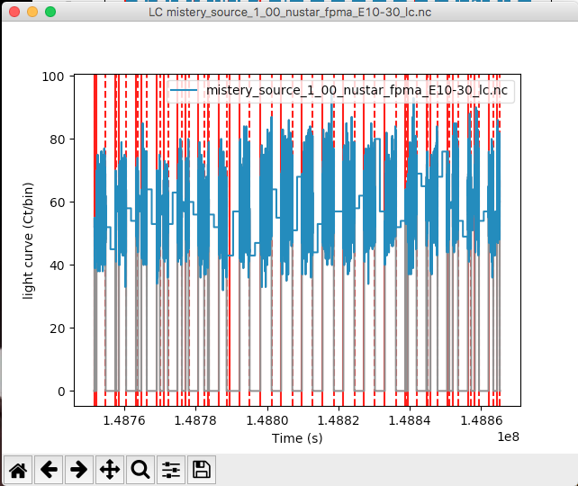

.. _data-exploration-tutorial:

Data exploration
----------------

.. Note ::

    For a general introduction to HENDRICS's workflow, please read the
    :ref:`quicklook-tutorial` tutorial

.. raw:: html

    

        <iframe width="560" height="315" src="https://www.youtube.com/embed/pMericAWmLU" frameborder="0" allowfullscreen></iframe>
    

In this tutorial, we will explore a NuSTAR dataset and try to get a general view
of the observed source.

Load events and GTIs
~~~~~~~~~~~~~~~~~~~~

First of all, let us load the event list in a more manageable file

    $ HENreadevents mistery_source_1_00.evt --min-length 512

The ``min-length`` option says to discard GTIs shorter than 512 s.
Note that the understanding of good time intervals extensions is sometimes difficult to do automatically,
as different missions have different standard naming of these extensions. Most NASA missions should be
correctly handled, plus XMM-Newton; however, if you notice something strange in the GTI extension
reading, or if you are using non-standard user GTI extensions, please specify explicitly the extension
names or regular expressions. For example, to read the user-defined GTIs and the standard GTIs for
detector 01 of XMM-Newton/EPIC-pn the command might be something like:

    $ HENreadevents mistery_source_xmm.fits --gtistring 'GTI001.*,STDGTI01'

See the help of ``HENreadevents`` for more details.

Calibrate events (deprecated, use with caution)
~~~~~~~~~~~~~~~~~~~~~~~~~~~~~~~~~~~~~~~~~~~~~~~

For NuSTAR, XMM, and NICER, ``HENreadevents``,  also "calibrates" the data, which means that it converts the "energy channel" of a photon into an energy in units of kilo-electronVolts (keV).
For NuSTAR, XMM, and NICER, there should be no need to do any further calibration.
In specific case where the user wants to apply a different calibration, using a custom RMF, one can use ``HENcalibrate``.

    $ HENcalibrate mistery_source_1_00_nustar_fpma_ev.nc

The latter works only for *NuSTAR*, and if the official rmf files are in the CALDB. Otherwise,
the ``--rmf`` option has to be used, providing a custom redistribution matrix file

    $ HENcalibrate mistery_source_1_00_nustar_fpma_ev.nc --rmf my_rmf_file.rmf

(see ``HENcalibrate -h``
for details).

Create and plot a light curve
~~~~~~~~~~~~~~~~~~~~~~~~~~~~~
Then, let's calculate and plot a light curve binned at 10 s, between 3 and 5 keV, and taking a "safe"
interval around GTIs of 100 s (for example, to account for increased particle background close to
SAA)

    $ HENlcurve -b 10 mistery_source_1_00_nustar_fpma_ev.nc --safe-interval 100 100 -e 3 5

    $ HENplot mistery_source_1_00_nustar_fpma_E3-5_lc.nc

|lc.png|

This plot shows the GTI borders in red, and the light curve before (grey) and after (blue) filtering
for safe intervals around GTIs. Some intervals with decreasing flux can be seen in the grey light curve,
a sign that a filtering _was_ needed.

Color-color diagram
~~~~~~~~~~~~~~~~~~~
Now, let's produce a color-color diagram.

First of all, we need to produce two color light curves:

    $ HENcolors -b 100 mistery_source_1_00_nustar_fpma_ev.nc -e 2 5 5 8
    $ HENcolors -b 100 mistery_source_1_00_nustar_fpma_ev.nc -e 8 12 12 30

Then, we can plot these new light curves and see if there is anything interesting there.

    $ HENplot --CCD mistery_source_1_00_nustar_fpma_E_8-5_over_5-2.nc  mistery_source_1_00_nustar_fpma_E_30-12_over_12-8.nc

|colorcolor.png|

.. |colorcolor.png| image:: ../images/colorcolor.png

