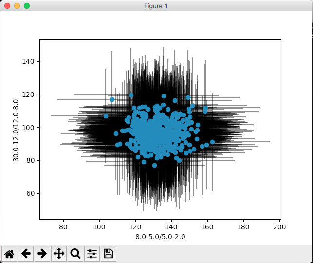

.. _data-exploration-tutorial:

Data exploration
----------------

.. Note ::

    For a general introduction to HENDRICS's workflow, please read the
    :ref:`quicklook-tutorial` tutorial

In this tutorial, we will explore a NuSTAR dataset and try to get a general view
of the observed source.

First of all, let us load the event list in a more manageable file, and calibrate it.

    $ HENreadevents mistery_source_1_00.evt --min-length 512
    $ HENcalibrate mistery_source_1_00_nustar_fpma_ev.nc

The latter works only if the official rmf files are in the CALDB. Otherwise, the ``--rmf`` option
has to be used (see ``HENcalibrate -h`` for details).
The ``min-length`` option says to discard GTIs shorter than 512.
Then, let's calculate and plot a light curve binned at 10 s, between 3 and 5 keV, and taking a "safe"
interval around GTIs of 100 s (for example, to account for increased particle background close to
SAA)

    $ HENlcurve -b 10 mistery_source_1_00_nustar_fpma_ev_calib.nc --safe-interval 100 100 -e 3 5

    $ HENplot mistery_source_1_00_nustar_fpma_E3-5_lc.nc

|lc.png|

This plot shows the GTI borders in red, and the light curve before (grey) and after (blue) filtering
for safe intervals around GTIs. Some intervals with decreasing flux can be seen in the grey light curve,
a sign that a filtering _was_ needed.

Now, let's produce a color-color diagram.

First of all, we need to produce two color light curves:

    $ HENcolors -b 100 mistery_source_1_00_nustar_fpma_ev_calib.nc -e 2 5 5 8
    $ HENcolors -b 100 mistery_source_1_00_nustar_fpma_ev_calib.nc -e 8 12 12 30

Then, we can plot these new light curves and see if there is anything interesting there.

    $ HENplot --CCD mistery_source_1_00_nustar_fpma_E_8-5_over_5-2.nc  mistery_source_1_00_nustar_fpma_E_30-12_over_12-8.nc

|colorcolor.png|

