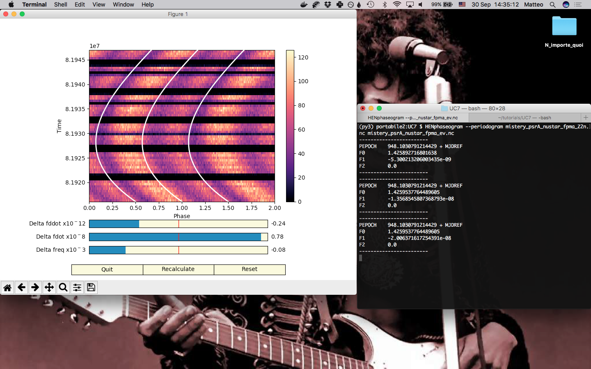
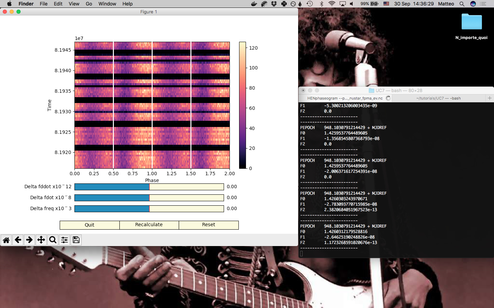

.. _pulsation-searches-tutorial:

Pulsation searches
------------------

.. Note ::

    For a general introduction to HENDRICS's workflow, please read the
    :ref:`quicklook-tutorial` tutorial

We have a pulsar observation with, e.g., *NuSTAR* and we want to find pulsations on it.
The general procedure is looking for pulsations using a power density spectrum
(see :ref:`quicklook-tutorial`) or similar methods, and if we do find a promising
candidate frequency, investigate more with the Epoch Folding or the Z search.

Let's say we have found a peak in the power density spectrum at about 0.101
seconds, or 9.9 Hz, and we want to investigate more.

We start from the _event_ file. If we have run `HENreadevents` on the original
mission-specific event file, we have a HENRICS-format event file (ending with
`_ev.nc` or `_ev.p`), e.g.

::

    $ ls
    002A.evt 002A_ev.nc

To look for pulsations with the epoch folding around the candidate frequency
9.9 Hz, we can run `HENefsearch` as such:

::

    $ HENefsearch -f 9.85 -F 9.95 -n 64 --fit-candidates

where the options `-f` and `-F` give the minimum and maximum frequencies to
search, `-n` the number of bins in the pulsed profile and with `--fit-candidates`
we specify to not limit the search to the epoch folding, but also look for
peaks and fit them to find their centroids.

The output of the search is in a file ending with `_EF.nc` or `_EF.p`, while
the best-fit model is recorded in pickle files

::

    $ ls
        002A.evt 002A_ev.nc 002A_EF.nc 002A_EF__mod0__.p

To use the Z search, we can use the `HENzsearch` script with very similar options:

::

    $ HENzsearch -f 9.85 -F 9.95 -N 2 --fit-candidates

where the `-N` option specifies the number of harmonics to use for the search.

The output of the search and the fit is recorded in similar files as Epoch folding

::

    $ ls
        002A.evt 002A_ev.nc 002A_Z2n.nc 002A_Z2n__mod0__.p

We can plot the results of this search with `HENplot`, as such:

::

    $ HENplot 002A_Z2n.nc

|zn_search.png|

.. |zn_search.png| image:: ../images/zn_search.png

NEW: Fast searches
~~~~~~~~~~~~~~~~~~
HENDRICS now implements a much faster, experimental algorithm for pulsation searches.
Select this algorithm with the ``--fast`` option on the command line of `HENzsearch`.
Instead of calculating the phase of all photons at each trial value of frequency and
derivative, we pre-bin the data in small chunks and shift the different chunks to the
amount required by different trial values.

|fast_zsearch.jpeg|

Each pre-folding leads to a large number of trial values to be evaluated. This only
works if we assume that the trial frequency is sufficiently close to the initial one
that no signal leaks into nearby bins inside the sub-profiles. This requires that we
choose a sufficiently large number of sub-profiles, and limit the total shift to
reasonable values to limit this leak.

Given the wanted range of frequencies to search, the program chooses automatically the
number of trial frequencies and fdots to derive from each given pre-folding, and when
to perform a new pre-folding.

At the moment, the trial fdots are chosen automatically and cannot be defined by the user.
The only actions the user can do are the selection of the mean fdot and the parameter
``--npfact`` that increases the number of trial values to obtain from a single central
frequency/fdot combination (npfact=2 means that the number of trial values will be
double for both the frequency and the fdot, so four times the trials in the end).

The results of this Z search can be plotted with `HENplot`. There is at the moment
no automatic fitting being performed as in the slow option.

.. |fast_zsearch.jpeg| image:: ../images/fast_zsearch.jpeg

Searching for pulsars and measuring frequency derivatives interactively
~~~~~~~~~~~~~~~~~~~~~~~~~~~~~~~~~~~~~~~~~~~~~~~~~~~~~~~~~~~~~~~~~~~~~~~

``HENphaseogram`` is an interactive phaseogram to adjust the values of the frequency and frequency derivatives of pulsars.

|phaseogram1.png|

|phaseogram2.png|

.. raw:: html

    

        <iframe width="560" height="315" src="https://www.youtube.com/embed/irm_S5rlqL8" frameborder="0" allowfullscreen></iframe>
    

